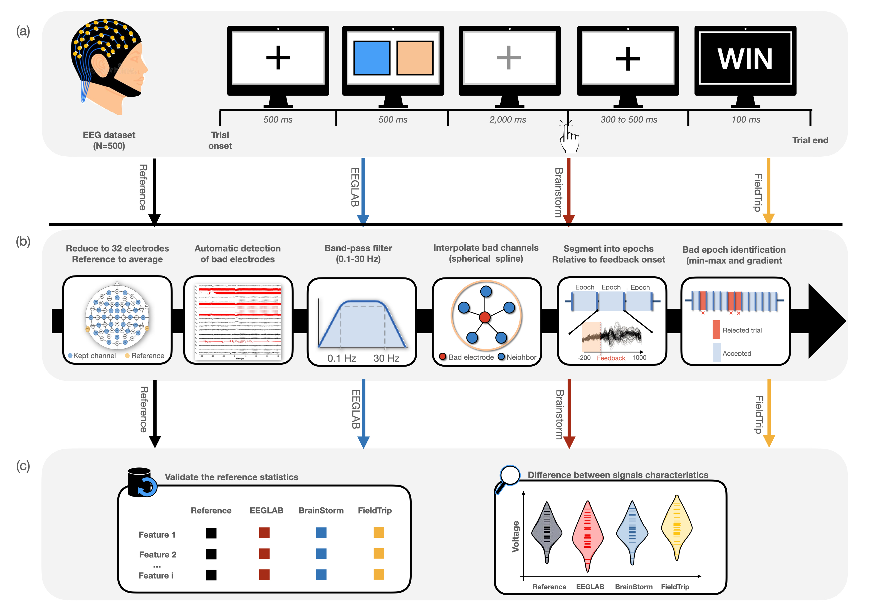

# Successful reproduction of a large EEG study across software packages

by
Aya Kabbara
Nina Forde
Camille Maumet
Mahmoud Hassan

> This is a guide for researchers to reproduce the results and figures published in the paper "Successful reproduction of a large EEG study across software packages".
>This paper has been submitted for publication in NeuroImage Reports.

This study sheds light on how the software tool used to preprocess EEG signals impacts the analysis results and conclusions. EEGLAB, Brainstorm and FieldTrip were used to reproduce the same preprocessing pipeline of a published EEG study performed on 500 participants.



*The full pipeline of the study. (a) EEGs were acquired from 500 participants performing a simple gambling task of six blocks composed of 20 trials. (b) The same dataset was then preprocessed using the different software tools: Reference (using the code published by the original paper (Williams et al. 2021)), EEGLAB, Brainstorm and FieldTrip. The preprocessing steps to be performed in each tool includes: the reduction to 32 electrodes, the re-referencing, the automatic detection of bad electrodes, the band-pass filtering, the interpolation of bad channels, the segmentation into time-locked epochs and the removal of artifactual trials. (c) The preprocessed signals derived from the four preprocessing codes are used to validate and reproduce the reference statistics and hypotheses. A quantitative comparison between the resulting signals is also conducted in terms of signal features*


## Abstract

As an active field of research, Electroencephalography (EEG) analysis workflow has increasing flexibility and complexity, with a great variety of methodological options and tools to be selected at each step. This high analytical flexibility can be problematic as it can yield variability in research outcomes. Therefore, growing attention has been recently paid to understand the potential of different methodological decisions to influence the reproducibility of results. In this paper, we aim to examine how sensitive the results of EEG analyses are to variations in software tools. We reanalyzed shared EEG data (N=500) previously used in a published task EEG study using three of the most commonly used software tools: EEGLAB, Brainstorm and FieldTrip. After reproducing the same original preprocessing workflow in each software, the resultant evoked-related potentials (ERPs) were qualitatively and quantitatively compared in order to examine the degree of consistency/discrepancy between softwares. Our findings show a good degree of convergence in terms of the general profile of ERP waveforms, peak latencies and effect size estimates related to specific signal features. However, considerable variability was also observed between software packages as reflected by the similarity values and observed statistical differences at particular channels and time instants. In conclusion, we believe that this study provides valuable clues to better understand the impact of the software tool on analysis results of EEG.

## Software implementation

> In each software, the preprocessing script includes the reduction to 32 electrodes, the re-referencing, the automatic detection of bad electrodes, the band-pass filtering, the interpolation of bad channels, the segmentation into time-locked epochs and the removal of artifactual trials.Briefly describe the software that was written to produce the results of this
> paper.


All the preprocessing codes were written in Matlab (Matlab R2019a). The visualizations of ERP waveforms (Figure 2) and the quantitative features (Figure 3) were done in R (R Core Team 2020). Seaborn (Waskom 2021) was used to illustrate the comparison between the software distribution of the quantitative measures (Figure 4), and the similarity matrix between softwares (Figure 5). Other visualizations and statistical assessments were conducted using Matlab. 

All source code used to generate the results and figures in the paper are in
the `src` folder.
The figure generation of figure 5 is run inside
[Jupyter notebooks](http://jupyter.org/).
The data used in this study is stored in `data` and downloaded from https://osf.io/qrs4h/.
Results generated by the code are saved in `results`.
See the `README.md` files in each directory for a full description.

## Getting the data

Download data from https://osf.io/qrs4h/ and store it `data` directory. 
The channel location file should be also downloaded from https://osf.io/ztw8u/ ChanlocsMaster.mat, and stored in `data` folder. 

## Getting the code

You can download a copy of all the files in this repository by cloning the
[git](https://git-scm.com/) repository:

    git clone https://github.com/AyaKabbara/StageEEGpre.git

or [download a zip archive](https://github.com/AyaKabbara/StageEEGpre/archive/master.zip).

## Dependencies
- Reference script: To re-run the script of the reference paper,  one should first download the Neuro-Tools package from https://github.com/Neuro-Tools/ including https://github.com/Neuro-Tools/MATLAB-EEG-preProcessing
https://github.com/Neuro-Tools/MATLAB-EEG-fileIO
https://github.com/Neuro-Tools/MATLAB-EEG-timeFrequencyAnalysis
https://github.com/Neuro-Tools/MATLAB-EEG-icaTools

- EEGLAB script : This script uses EEGLAB functions available at  https://sccn.ucsd.edu/eeglab/download.php  eeglab current version

- Brainstorm script : This script uses Brainstorm functions available at https://neuroimage.usc.edu/bst/download.php

- FieldTrip script: This script uses FieldTrip functions available at https://www.fieldtriptoolbox.org/download/

## Reproducing the results

### Reproducing Figures

#### Reproducing Figure 2A, Figure 3A  using the reference script of (Williams et al, 2021)

> We used the same preprocessing code provided by the original paper, by eliminating the step of manual ICA employed to detect the arttifactual components related to eye blinks

1. Add path to dependencies already cited using:
```
    addpath(genpath('dependencyDir'))
```
2. Run the script [RewardsPreprocessing_withoutICA.m](https://github.com/AyaKabbara/StageEEGpre/tree/main/src/article/RewardsPreprocessing_withoutICA.m). This script will save the erp of all participants in a .mat file. It will also generate the csv files to be used for plotting figures 2,3 and for the calculation of descriptive statistics. 
3. Create figures and tables using the following R script: [RewardProcessing_Plots_and_Statistics.R](https://github.com/AyaKabbara/StageEEGpre/blob/main/src/graphiques/RewardProcessing_Plots_and_Statistics.R).
Note:  The name of csv files should be changed accordingly.

####  Reproducing Figure 2A, Figure 3A using EEGLAB

1. Run the analysis [eeglab_preprocessing.m](https://github.com/AyaKabbara/StageEEGpre/blob/main/src/eeglab/eeglab_preprocessing.m).
2. Create the figures using the R script [fig2Av2.R](https://github.com/Inria-Empenn/StageEEGpre/blob/main/src/codeR/fig2Av2.R). Note: the number of participants has to be updated to the number of participants included, the name of csv files should be changed accordingly.

We obtain [this figure](https://github.com/Inria-Empenn/StageEEGpre/blob/main/figures/articke%20fig2/100sujetseeglabfinal.png)

#### Reproducing Figure 2A using Brainstorm

1. Convert the dataset into EEGLAB set using the following functions: [toset.m](https://github.com/AyaKabbara/StageEEGpre/blob/main/src/BST/toset.m)  so that it can be recognized by BS
2. Run the analysis with [bsPreprocessing.m](https://github.com/AyaKabbara/StageEEGpre/blob/main/src/BST/bsPreprocessing.m). Note: the paths should be changed 
